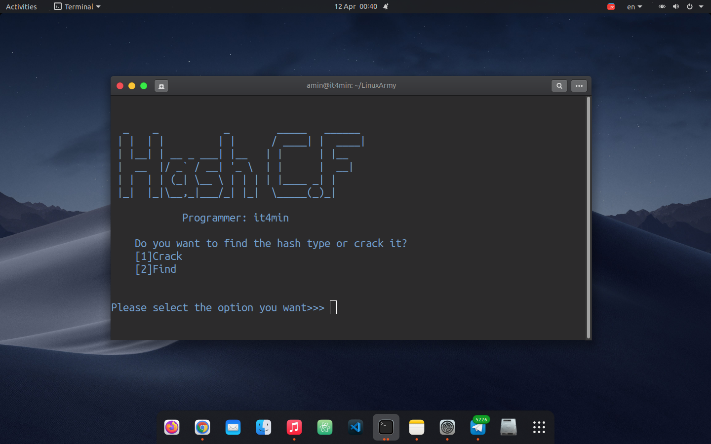

# hash-cf
<b>Hash Cracker and Hash Finder</b>
# Fa
<b>.شما با استفاده از این اسکریپت میتوانید نوع هش را شناسایی کرده و آنرا کرک کنید</b>
# En
<b>You can use this script to identify the type of hash and crack it.<b/>
 

 

# prerequisites
<pre><code>
apt update  
apt install git python3 -y   
</code></pre>

# Installation and execution
<pre><code>
git clone https://github.com/it4min/hash-cf  
cd hash-cf  
python3 hashcf.py
</code></pre>

# Telegram Channel 
<a href="t.me/LinuxArmy">Click to join<a> 

